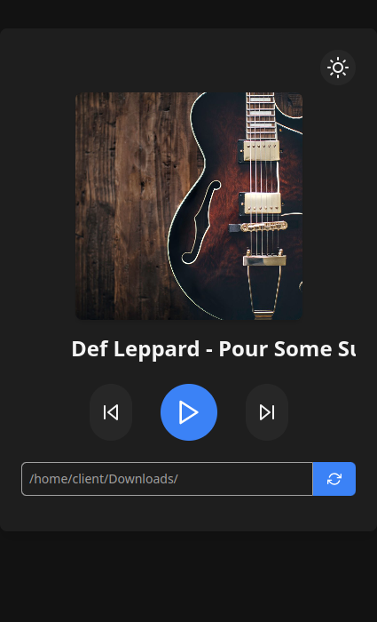

# PySound 1.7

## Instalação das Libs

python -m pip install -r requirements

### `Crirar ".exe"`

1. python -m pip install pyinstaller
2. python -m eel main.py web --noconsole --onefile -i web/favicon.ico --runtime-tmpdir %temp%/pysound

### `Executar`

python main.py

## Exemplo

