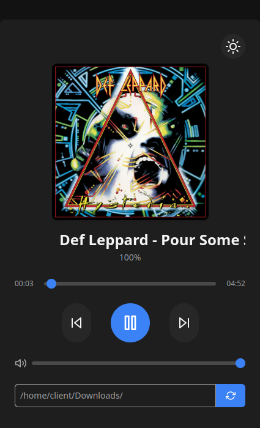

# PySound 1.8

## Instalação das Libs

  ```console
python -m pip install -r requirements.txt
  ```

### `Crirar ".exe"`
  ```console
python -m pip install pyinstaller
  ```
```console
python -m eel main.py web --noconsole --onefile -i web/favicon.ico --runtime-tmpdir %temp%
  ```
```console
python3 -m eel main.py web --noconsole --onefile -i web/favicon.ico --runtime-tmpdir /tmp
  ```
### `Executar`

  ```console
python main.py
  ```

## Exemplo


